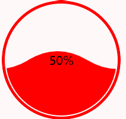

# vue-waterball
Vue module for creating chart like echarts-liquidfill by SVG in your application.


## Examples



## Requirements
Vue.js 2.x


## Installation
### npm
```
$ npm i vue-waterball -S
```

### yarn
```
$ yarn add vue-waterball
```
## Usage
main.js
```
import Vue from 'vue';
import WaterBall from 'vue-waterball';

Vue.component('WaterBall', WaterBall);
```
template:
```
<WaterBall />
```
## Attributes
| Attribute        | Description                                                                | Type   | Accepted Values           | Default    |
| ---------------- | -------------------------------------------------------------------------- | ------ | ------------------------- | ---------- |
| size             | width and height of component                                              | number | -                         | 200        |
| percentage       | value from 0 to 1                                                          | number | 0 to 1                    | 0.5        |
| border-width     | width of border                                                            | number | -                         | 5          |
| border-color     | color of border                                                            | string | -                         | '#F00'     |
| padding          | the distance between border and water                                      | number | -                         | 2          |
| background-color | background color of component                                              | string | -                         | '#FFF'     |
| water-color      | color of water                                                             | string | -                         | '#F00'     |
| dur              | on animation cycle duration, millisecond                                   | number | -                         | 5000       |
| amplitude        | times of half size, from 0 to 1, bigger number represents bigger amplitude | number | -                         | 0.3        |
| wave-length      | wave length, just use when type is 'horizontal'                            | number | -                         | 200        |
| font-size        | font size                                                                  | number | -                         | 20         |
| font-color       | font color                                                                 | string | -                         | '#000'     |
| type             | wave direction                                                             | string | 'horizontal' / 'vertical' | 'vertical' |
